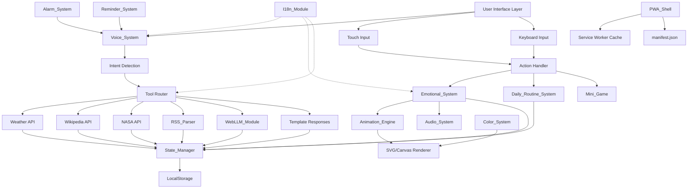

# Design Document: Mochi AI Virtual Pet PWA

## Overview

Mochi is a Progressive Web Application that combines a virtual pet experience with lightweight AI assistance. The system is architected for low-end devices, using vanilla JavaScript and a hybrid AI approach that prioritizes deterministic APIs for factual information while optionally enhancing personality through an in-browser language model.

The core design philosophy centers on three principles:

1. **Minimal Resource Consumption**: No heavy frameworks, lazy-loaded modules, optimized animations targeting 30fps on low-end devices
2. **Offline-First Architecture**: Full functionality without network except external API calls, with LocalStorage-based state persistence
3. **Hybrid AI System**: Deterministic Tool System for facts, optional WebLLM for personality, prewritten templates as fallback

The application provides emotional engagement through a virtual pet (Mochi) that expresses 5 emotional states, tracks daily routines, and responds to user interactions through voice, touch, and keyboard input. The system supports multilingual operation (English, Spanish, Italian) and includes practical assistant features: weather, Wikipedia lookups, NASA facts, news feeds, alarms, and reminders.

## Architecture

### System Architecture Diagram



### Module Organization

The codebase follows a clear separation of concerns:

```
/src
  /ui           - UI components and rendering logic
  /state        - State_Manager and LocalStorage persistence
  /animations   - Animation_Engine and rendering (SVG/Canvas)
  /voice        - Voice_System (SpeechRecognition/Synthesis)
  /apis         - Tool_System integrations (Weather, Wikipedia, NASA)
  /rss          - RSS_Parser for news feeds
  /i18n         - I18n_Module for multilingual support
  /llm          - WebLLM_Module (lazy-loaded)
  /games        - Mini_Game implementations
  /pwa          - PWA_Shell (manifest, service worker)
  /audio        - Audio_System for sound effects
```

### Hybrid AI System Architecture

The system uses a three-tier approach to handle user queries:

**Tier 1: Tool System (Deterministic APIs)**
- Primary layer for factual information
- Intent detection routes to appropriate API
- APIs: OpenWeatherMap, Wikipedia REST, NASA Open APIs, RSS feeds
- Fast, reliable, no hallucination risk
- Requires network connectivity

**Tier 2: WebLLM Module (Optional Personality Enhancement)**
- Lazy-loaded 1B-2B parameter quantized model
- Rewrites Tool System outputs to add emotional personality
- Generates short conversational replies for non-tool interactions
- Only used when available and performant
- Runs entirely in-browser (offline capable)

**Tier 3: Template Responses (Fallback)**
- Prewritten response templates for common interactions
- Used when WebLLM is unavailable, slow, or not loaded
- Localized for all supported languages
- Zero latency, zero resource consumption

### Intent Detection and Routing Logic

```javascript
// Pseudo-code for intent routing
function routeIntent(userInput) {
  const intent = detectIntent(userInput);
  
  switch(intent.type) {
    case 'WEATHER':
      return await weatherAPI.fetch(intent.params);
    case 'WIKIPEDIA':
      return await wikipediaAPI.fetch(intent.params);
    case 'NASA':
      return await nasaAPI.fetch(intent.params);
    case 'NEWS':
      return await rssParser.fetch(intent.params);
    case 'CONVERSATIONAL':
      if (webLLM.isLoaded() && webLLM.isResponsive()) {
        return await webLLM.generate(userInput);
      }
      return templateResponses.get(intent.subtype);
    default:
      return templateResponses.get('default');
  }
}
```

Intent detection uses keyword matching and pattern recognition:
- Weather: "weather", "temperature", "forecast", "rain", "sunny"
- Wikipedia: "what is", "who is", "tell me about", "explain"
- NASA: "space", "planet", "star", "astronomy", "NASA"
- News: "news", "headlines", "what's happening"

## Components and Interfaces

### Animation_Engine

**Responsibility**: Render Mochi's visual appearance and animations

**Interface**:
```javascript
class AnimationEngine {
  constructor(renderMode: 'svg' | 'canvas');
  
  // Render Mochi with current emotional state
  render(emotionalState: EmotionalState, colorPreset: ColorPreset): void;
  
  // Update facial expression
  updateExpression(emotion: Emotion): void;
  
  // Trigger animation sequence
  playAnimation(animationType: AnimationType): Promise<void>;
  
  // Set target framerate
  setTargetFPS(fps: number): void;
}
```

**Implementation Details**:
- SVG rendering is primary mode (lightweight, scalable)
- Canvas fallback for devices without SVG support
- Animation loop uses requestAnimationFrame with frame skipping for performance
- Facial expressions: eye shapes, mouth curves, blush opacity
- Animation types: idle, eating, playing, sleeping, talking
- Target 30fps minimum on low-end devices

### Emotional_System

**Responsibility**: Manage Mochi's emotional states and mood levels

**Interface**:
```javascript
class EmotionalSystem {
  constructor(stateManager: StateManager);
  
  // Get current emotional state
  getCurrentState(): EmotionalState;
  
  // Transition to new emotional state
  transitionTo(emotion: Emotion, reason: string): void;
  
  // Update mood level (-100 to 100)
  adjustMood(delta: number): void;
  
  // Update hunger level (0 to 100)
  adjustHunger(delta: number): void;
  
  // Update energy level (0 to 100)
  adjustEnergy(delta: number): void;
  
  // Get dialogue response for current emotion
  getDialogue(context: string): string;
}
```

**Emotional States**:
- Happy: mood > 50, hunger < 50, energy > 30
- Hungry: hunger > 70
- Sleepy: energy < 20
- Angry: mood < -30
- Playing: triggered by play action

**State Transitions**:
- Automatic transitions based on level thresholds
- Manual transitions triggered by user actions
- Transition triggers animation and dialogue updates

### Daily_Routine_System

**Responsibility**: Track expected daily interactions and adjust mood

**Interface**:
```javascript
class DailyRoutineSystem {
  constructor(stateManager: StateManager, emotionalSystem: EmotionalSystem);
  
  // Check for missed interactions
  evaluateMissedInteractions(): void;
  
  // Record interaction completion
  recordInteraction(interactionType: InteractionType): void;
  
  // Get next expected interaction
  getNextExpectedInteraction(): ExpectedInteraction | null;
}
```

**Expected Interactions**:
- Morning Breakfast: 6:00 AM - 9:00 AM
- Midday Lunch: 11:00 AM - 2:00 PM
- Afternoon Return Home: 4:00 PM - 6:00 PM
- Evening Dinner: 6:00 PM - 9:00 PM

**Mood Adjustments**:
- Completed interaction: +15 mood
- Missed interaction: -10 mood
- Evaluation runs on app load and every hour

### Voice_System

**Responsibility**: Handle speech recognition and synthesis

**Interface**:
```javascript
class VoiceSystem {
  constructor(i18nModule: I18nModule);
  
  // Start listening for voice input
  startListening(): Promise<string>;
  
  // Stop listening
  stopListening(): void;
  
  // Speak text using synthesis
  speak(text: string, emotion: Emotion): Promise<void>;
  
  // Check if Web Speech API is available
  isAvailable(): boolean;
}
```

**Implementation Details**:
- Uses Web Speech API SpeechRecognition for input
- Uses Web Speech API SpeechSynthesis for output
- Language set based on I18n_Module current language
- Voice output limited to 1-6 words for typical playful phrases
- Fallback to text-only display when API unavailable
- Emotion affects speech rate and pitch

### Tool_System

**Responsibility**: Integrate with external APIs and route intents

**Interface**:
```javascript
class ToolSystem {
  constructor(i18nModule: I18nModule);
  
  // Detect intent from user input
  detectIntent(input: string): Intent;
  
  // Route intent to appropriate tool
  routeIntent(intent: Intent): Promise<ToolResponse>;
  
  // Weather API integration
  fetchWeather(location: string): Promise<WeatherData>;
  
  // Wikipedia API integration
  fetchWikipedia(topic: string): Promise<WikipediaData>;
  
  // NASA API integration
  fetchNASA(query: string): Promise<NASAData>;
}
```

**API Integrations**:

1. **OpenWeatherMap API**
   - Endpoint: `https://api.openweathermap.org/data/2.5/weather`
   - Requires API key (user-provided or default)
   - Returns: temperature, conditions, humidity, wind speed
   - Error handling: network timeout, invalid location, API limit

2. **Wikipedia REST API**
   - Endpoint: `https://{lang}.wikipedia.org/api/rest_v1/page/summary/{topic}`
   - Language-aware (en, es, it)
   - Returns: title, extract (summary), thumbnail
   - Error handling: topic not found, network timeout

3. **NASA Open APIs**
   - Endpoint: `https://api.nasa.gov/planetary/apod` (Astronomy Picture of the Day)
   - Requires API key (DEMO_KEY for testing)
   - Returns: title, explanation, image URL
   - Error handling: network timeout, API limit

### RSS_Parser

**Responsibility**: Fetch and parse RSS news feeds

**Interface**:
```javascript
class RSSParser {
  constructor(i18nModule: I18nModule);
  
  // Fetch news from default feed based on language
  fetchNews(): Promise<NewsItem[]>;
  
  // Fetch news from custom RSS URL
  fetchCustomFeed(url: string): Promise<NewsItem[]>;
  
  // Parse RSS XML to NewsItem array
  parseRSS(xmlString: string): NewsItem[];
}
```

**Default Feeds**:
- English: CNN RSS (https://rss.cnn.com/rss/edition.rss)
- Spanish: CNN Spanish RSS (https://cnnespanol.cnn.com/feed/)
- Italian: RAI News RSS (https://www.rainews.it/rss/homepage.xml)

**Implementation Details**:
- Uses DOMParser to parse RSS XML
- Extracts: title, description, pubDate, link
- Returns top 5 headlines
- CORS proxy may be needed for some feeds

### WebLLM_Module

**Responsibility**: Provide personality enhancement through in-browser LLM

**Interface**:
```javascript
class WebLLMModule {
  // Lazy-load the module
  static async load(): Promise<WebLLMModule>;
  
  // Check if module is loaded
  isLoaded(): boolean;
  
  // Check if module is responsive (not hanging)
  isResponsive(): boolean;
  
  // Rewrite tool output to add personality
  rewriteWithPersonality(toolOutput: string, emotion: Emotion): Promise<string>;
  
  // Generate conversational reply
  generateReply(userInput: string, emotion: Emotion): Promise<string>;
  
  // Unload module to free memory
  unload(): void;
}
```

**Implementation Details**:
- Uses WebLLM library with quantized 1B-2B parameter model
- Model candidates: TinyLlama-1.1B, Phi-2-2.7B (quantized)
- Lazy-loaded via dynamic import
- System prompt: "You are Mochi, a cute virtual pet. Respond in 1-6 words with emotion."
- Timeout: 5 seconds max for generation
- Falls back to templates if slow or unavailable

### State_Manager

**Responsibility**: Manage application state and LocalStorage persistence

**Interface**:
```javascript
class StateManager {
  // Load state from LocalStorage
  loadState(): AppState;
  
  // Save state to LocalStorage
  saveState(state: AppState): void;
  
  // Update specific state property
  updateState(key: string, value: any): void;
  
  // Get specific state property
  getState(key: string): any;
  
  // Clear all state (reset app)
  clearState(): void;
  
  // Parse configuration from JSON
  parseConfiguration(json: string): Result<Configuration, Error>;
  
  // Format configuration to JSON
  formatConfiguration(config: Configuration): string;
}
```

**State Persistence Strategy**:
- Save on every state change (debounced 500ms)
- Load on app initialization
- Validate loaded state against schema
- Use default values for missing/invalid properties
- Atomic writes to prevent corruption

### PWA_Shell

**Responsibility**: Provide Progressive Web App infrastructure

**Components**:

1. **manifest.json**
```json
{
  "name": "Mochi AI Pet",
  "short_name": "Mochi",
  "description": "AI Virtual Pet + Lightweight Assistant",
  "start_url": "/",
  "display": "standalone",
  "background_color": "#ffffff",
  "theme_color": "#ff69b4",
  "icons": [
    { "src": "/icons/icon-72.png", "sizes": "72x72", "type": "image/png" },
    { "src": "/icons/icon-96.png", "sizes": "96x96", "type": "image/png" },
    { "src": "/icons/icon-128.png", "sizes": "128x128", "type": "image/png" },
    { "src": "/icons/icon-144.png", "sizes": "144x144", "type": "image/png" },
    { "src": "/icons/icon-152.png", "sizes": "152x152", "type": "image/png" },
    { "src": "/icons/icon-192.png", "sizes": "192x192", "type": "image/png" },
    { "src": "/icons/icon-384.png", "sizes": "384x384", "type": "image/png" },
    { "src": "/icons/icon-512.png", "sizes": "512x512", "type": "image/png" }
  ]
}
```

2. **Service Worker**
```javascript
// Cache strategy: Cache-First for static assets, Network-First for API calls
const CACHE_NAME = 'mochi-v1';
const STATIC_ASSETS = [
  '/',
  '/index.html',
  '/styles.css',
  '/app.js',
  '/icons/*',
  '/sounds/*'
];

self.addEventListener('install', (event) => {
  event.waitUntil(
    caches.open(CACHE_NAME).then((cache) => cache.addAll(STATIC_ASSETS))
  );
});

self.addEventListener('fetch', (event) => {
  if (event.request.url.includes('/api/')) {
    // Network-First for API calls
    event.respondWith(networkFirst(event.request));
  } else {
    // Cache-First for static assets
    event.respondWith(cacheFirst(event.request));
  }
});
```

### Alarm_System

**Responsibility**: Manage daily alarms

**Interface**:
```javascript
class AlarmSystem {
  constructor(stateManager: StateManager, voiceSystem: VoiceSystem, audioSystem: AudioSystem);
  
  // Set daily alarm
  setAlarm(time: string): void;
  
  // Cancel alarm
  cancelAlarm(): void;
  
  // Check if alarm should trigger
  checkAlarm(): void;
  
  // Trigger alarm
  triggerAlarm(): void;
}
```

**Implementation Details**:
- Uses setInterval to check every minute
- Compares current time with alarm time
- Triggers voice message: "{day of week}, {time}, {greeting}"
- Plays alarm sound via Audio_System
- Works offline using device local time

### Reminder_System

**Responsibility**: Manage user reminders

**Interface**:
```javascript
class ReminderSystem {
  constructor(stateManager: StateManager, voiceSystem: VoiceSystem, audioSystem: AudioSystem);
  
  // Create reminder
  createReminder(text: string, time: Date): string;
  
  // Delete reminder
  deleteReminder(id: string): void;
  
  // Get all active reminders
  getReminders(): Reminder[];
  
  // Check if any reminders should trigger
  checkReminders(): void;
  
  // Trigger reminder
  triggerReminder(reminder: Reminder): void;
}
```

**Implementation Details**:
- Uses setInterval to check every minute
- Supports multiple simultaneous reminders
- Triggers voice message with reminder text
- Plays notification sound via Audio_System
- Removes reminder after triggering

### Color_System

**Responsibility**: Manage theme and color presets

**Interface**:
```javascript
class ColorSystem {
  constructor(stateManager: StateManager);
  
  // Set color preset
  setColor(preset: ColorPreset): void;
  
  // Get current color
  getCurrentColor(): ColorPreset;
  
  // Get color palette for preset
  getPalette(preset: ColorPreset): ColorPalette;
}
```

**Color Presets**:
- White, Black, Pink, Blue, Green, Yellow, Purple, Orange, Cyan, Peach, Lime, Lavender

**Color Palette Structure**:
```javascript
{
  primary: string,      // Main Mochi body color
  secondary: string,    // Accent color (blush, highlights)
  background: string,   // App background
  text: string          // Text color
}
```

### Mini_Game

**Responsibility**: Provide simple touch-optimized game

**Interface**:
```javascript
class MiniGame {
  constructor(emotionalSystem: EmotionalSystem);
  
  // Start game
  start(): void;
  
  // Update game state (called every frame)
  update(deltaTime: number): void;
  
  // Render game (called every frame)
  render(ctx: CanvasRenderingContext2D): void;
  
  // Handle touch/click input
  handleInput(x: number, y: number): void;
  
  // End game
  end(): void;
}
```

**Game Mechanics** (one of):
1. **Tap Mochi**: Tap Mochi as many times as possible in 15 seconds
2. **Catch Falling Food**: Tap falling food items before they hit the ground
3. **Reaction Tap**: Tap when Mochi changes color

**Implementation Details**:
- Canvas-based rendering for performance
- Touch-optimized (large tap targets)
- 10-30 second duration
- Increases mood on completion
- Target 30fps on low-end devices

### I18n_Module

**Responsibility**: Provide multilingual support

**Interface**:
```javascript
class I18nModule {
  constructor();
  
  // Detect language from browser
  detectLanguage(): Language;
  
  // Set language
  setLanguage(lang: Language): void;
  
  // Get current language
  getCurrentLanguage(): Language;
  
  // Translate key
  t(key: string, params?: object): string;
  
  // Get localized date/time format
  formatDateTime(date: Date): string;
}
```

**Supported Languages**:
- English (en)
- Spanish (es)
- Italian (it)

**Translation Structure**:
```javascript
{
  "ui.feed": "Feed",
  "ui.play": "Play",
  "ui.talk": "Talk",
  "ui.sleep": "Sleep",
  "dialogue.happy": "Yay!",
  "dialogue.hungry": "Hungry...",
  "notification.support": "Enjoying Mochi? ☕ Support the project",
  "alarm.greeting.morning": "Good morning!",
  "error.weather.failed": "Couldn't get weather",
  // ... more translations
}
```

### Audio_System

**Responsibility**: Play sound effects and notifications

**Interface**:
```javascript
class AudioSystem {
  constructor();
  
  // Play sound effect
  play(soundType: SoundType): void;
  
  // Stop all sounds
  stopAll(): void;
  
  // Set volume (0.0 to 1.0)
  setVolume(volume: number): void;
  
  // Check if audio is available
  isAvailable(): boolean;
}
```

**Sound Types**:
- happy: Short cheerful beep
- hungry: Low rumble
- sleep: Soft chime
- alarm: Persistent beeping
- notification: Single bell tone

**Implementation Details**:
- Uses Web Audio API (preferred) or HTML5 Audio API (fallback)
- Sounds stored as lightweight audio files (< 10KB each)
- Preload all sounds on app initialization
- Respect user's device volume settings

## Data Models

### AppState

Complete application state persisted to LocalStorage:

```javascript
interface AppState {
  // Emotional state
  emotion: Emotion;              // 'happy' | 'hungry' | 'sleepy' | 'angry' | 'playing'
  mood: number;                  // -100 to 100
  hunger: number;                // 0 to 100
  energy: number;                // 0 to 100
  
  // Interaction tracking
  lastInteraction: number;       // Unix timestamp
  dailyInteractions: {
    breakfast: number | null;    // Unix timestamp or null
    lunch: number | null;
    returnHome: number | null;
    dinner: number | null;
  };
  
  // User preferences
  language: Language;            // 'en' | 'es' | 'it'
  colorPreset: ColorPreset;      // 'white' | 'black' | 'pink' | ...
  
  // Alarms and reminders
  alarm: {
    enabled: boolean;
    time: string;                // HH:MM format
  } | null;
  reminders: Reminder[];
  
  // Installation tracking
  firstInstall: number;          // Unix timestamp
  supportNotificationShown: boolean;
  
  // WebLLM state
  webLLMEnabled: boolean;
  webLLMLoaded: boolean;
}
```

### Configuration

Configuration object for parsing/formatting:

```javascript
interface Configuration {
  language: Language;
  colorPreset: ColorPreset;
  alarm: {
    enabled: boolean;
    time: string;
  } | null;
  reminders: Reminder[];
  webLLMEnabled: boolean;
}
```

### Reminder

```javascript
interface Reminder {
  id: string;                    // UUID
  text: string;                  // Reminder message
  time: number;                  // Unix timestamp
  created: number;               // Unix timestamp
}
```

### EmotionalState

```javascript
interface EmotionalState {
  emotion: Emotion;
  mood: number;
  hunger: number;
  energy: number;
  expression: FacialExpression;
}
```

### FacialExpression

```javascript
interface FacialExpression {
  eyeShape: 'normal' | 'happy' | 'sleepy' | 'angry';
  mouthCurve: number;            // -1.0 to 1.0 (frown to smile)
  blushOpacity: number;          // 0.0 to 1.0
}
```

### Intent

```javascript
interface Intent {
  type: IntentType;              // 'weather' | 'wikipedia' | 'nasa' | 'news' | 'conversational'
  params: {
    location?: string;
    topic?: string;
    query?: string;
  };
  confidence: number;            // 0.0 to 1.0
}
```

### ToolResponse

```javascript
interface ToolResponse {
  success: boolean;
  data: any;
  error?: string;
  source: 'weather' | 'wikipedia' | 'nasa' | 'rss' | 'llm' | 'template';
}
```

### WeatherData

```javascript
interface WeatherData {
  location: string;
  temperature: number;           // Celsius
  conditions: string;            // "Clear", "Cloudy", "Rainy", etc.
  humidity: number;              // Percentage
  windSpeed: number;             // km/h
}
```

### WikipediaData

```javascript
interface WikipediaData {
  title: string;
  extract: string;               // Summary text
  thumbnail?: string;            // Image URL
  url: string;                   // Full article URL
}
```

### NASAData

```javascript
interface NASAData {
  title: string;
  explanation: string;
  imageUrl: string;
  date: string;
}
```

### NewsItem

```javascript
interface NewsItem {
  title: string;
  description: string;
  pubDate: string;
  link: string;
}
```

### ColorPalette

```javascript
interface ColorPalette {
  primary: string;               // Hex color
  secondary: string;             // Hex color
  background: string;            // Hex color
  text: string;                  // Hex color
}
```

### LocalStorage Schema

Data is stored in LocalStorage with the following keys:

```javascript
{
  "mochi_state": JSON.stringify(AppState),
  "mochi_config": JSON.stringify(Configuration)
}
```

**Persistence Strategy**:
- Debounced writes (500ms) to minimize I/O
- Atomic updates using try-catch with rollback
- Validation on read with fallback to defaults
- Size monitoring (LocalStorage typically 5-10MB limit)


## Correctness Properties

*A property is a characteristic or behavior that should hold true across all valid executions of a system—essentially, a formal statement about what the system should do. Properties serve as the bridge between human-readable specifications and machine-verifiable correctness guarantees.*

### Property 1: SVG Rendering Contains Required Elements

*For any* emotional state and color preset, when the Animation_Engine renders Mochi using SVG, the generated SVG should contain a circle element (body), two eye elements, a mouth element, and a blush element.

**Validates: Requirements 1.1**

### Property 2: Emotional State Change Updates Expression Within Time Bound

*For any* emotional state transition, the Animation_Engine should update the facial expression within 100ms of the transition.

**Validates: Requirements 1.4**

### Property 3: Color Selection Persists to LocalStorage

*For any* color preset, when a user selects it, the Color_System should persist that selection to LocalStorage.

**Validates: Requirements 2.4**

### Property 4: Color Selection Round-Trip

*For any* color preset, saving it to LocalStorage, reloading the application, and retrieving the color should produce the same color preset.

**Validates: Requirements 2.5**

### Property 5: Emotional State Transition Updates Expression

*For any* emotional state transition, the Emotional_System should trigger the corresponding facial expression update.

**Validates: Requirements 3.2**

### Property 6: Emotional State Transition Triggers Animation

*For any* emotional state transition, the Emotional_System should trigger the corresponding animation.

**Validates: Requirements 3.3**

### Property 7: Emotional State Affects Dialogue

*For any* emotional state, dialogue responses generated by the Emotional_System should be appropriate to that emotion.

**Validates: Requirements 3.4**

### Property 8: Emotional State Persists

*For any* emotional state, the State_Manager should persist it to LocalStorage.

**Validates: Requirements 3.5**

### Property 9: Completed Interaction Increases Mood

*For any* expected interaction (breakfast, lunch, return home, dinner), completing it should increase Mochi's mood level.

**Validates: Requirements 4.2**

### Property 10: Missed Interaction Decreases Mood

*For any* expected interaction, missing it should decrease Mochi's mood level.

**Validates: Requirements 4.3**

### Property 11: Feed Action Effects

*For any* application state, executing the Feed action should decrease hunger level and increase mood level.

**Validates: Requirements 5.1**

### Property 12: Play Action Effects

*For any* application state, executing the Play action should transition to Playing emotional state and increase mood level.

**Validates: Requirements 5.2**

### Property 13: Talk Action Activates Voice System

*For any* application state, executing the Talk action should activate the Voice_System.

**Validates: Requirements 5.3**

### Property 14: Sleep Action Effects

*For any* application state, executing the Sleep action should transition to Sleepy emotional state and restore energy level.

**Validates: Requirements 5.4**

### Property 15: Interaction Updates Timestamp

*For any* user interaction (Feed, Play, Talk, Sleep), the State_Manager should update the last interaction timestamp in LocalStorage.

**Validates: Requirements 5.5**

### Property 16: Interaction Triggers Animation

*For any* user interaction, the Animation_Engine should trigger the corresponding animation.

**Validates: Requirements 5.6**

### Property 17: Mini Game Duration Constraint

*For any* Mini_Game execution, the game should complete within 10 to 30 seconds.

**Validates: Requirements 6.1**

### Property 18: Game Completion Increases Mood

*For any* Mini_Game completion, the Emotional_System should increase Mochi's mood level.

**Validates: Requirements 6.4**

### Property 19: Voice Input Converts to Text

*For any* voice input captured by the Voice_System, it should be converted to text using the Web Speech API.

**Validates: Requirements 7.3**

### Property 20: Voice Output Synthesizes Speech

*For any* text response, when Mochi responds, the Voice_System should synthesize speech from the text.

**Validates: Requirements 7.4**

### Property 21: Playful Phrase Word Count

*For any* playful phrase response generated by the Voice_System, it should contain 1 to 6 words.

**Validates: Requirements 7.5**

### Property 22: Localization Coverage

*For any* supported language (English, Spanish, Italian), all UI text, Mochi dialogue, system messages, notifications, alarm messages, reminder messages, and API response formatting should be localized.

**Validates: Requirements 8.7**

### Property 23: Weather Request Fetches Data

*For any* weather information request, the Tool_System should fetch current weather conditions from the OpenWeatherMap API.

**Validates: Requirements 9.2**

### Property 24: Wikipedia Request Fetches Summary

*For any* topic information request, the Tool_System should fetch the Wikipedia summary for that topic.

**Validates: Requirements 10.2**

### Property 25: NASA Request Fetches Data

*For any* space information request, the Tool_System should fetch NASA data.

**Validates: Requirements 11.2**

### Property 26: API Response Language Formatting

*For any* API response (Weather, Wikipedia, NASA, RSS) and any supported language, the Tool_System should format the response according to that language.

**Validates: Requirements 9.3, 10.3, 11.3, 12.4**

### Property 27: API Failure Returns Localized Error

*For any* API request failure (Weather, Wikipedia, NASA, RSS), the Tool_System should return a localized error message in the current language.

**Validates: Requirements 9.4, 10.4, 11.4, 12.5**

### Property 28: Tool Intent Detection

*For any* user input containing tool-related keywords (weather, Wikipedia, NASA, news), the Tool_System should detect the correct intent type.

**Validates: Requirements 9.5, 10.5, 11.5, 12.6**

### Property 29: Custom RSS Feed Support

*For any* valid RSS feed URL, the RSS_Parser should be able to fetch and parse headlines and summaries.

**Validates: Requirements 12.2**

### Property 30: News Request Fetches Headlines

*For any* news request, the RSS_Parser should fetch headlines and short summaries.

**Validates: Requirements 12.3**

### Property 31: WebLLM Rewrites Tool Output

*For any* Tool_System output, when WebLLM_Module is loaded and responsive, it should be able to rewrite the output to add emotional personality.

**Validates: Requirements 13.3**

### Property 32: WebLLM Generates Conversational Replies

*For any* non-tool conversational input, when WebLLM_Module is loaded and responsive, it should generate a short reply.

**Validates: Requirements 13.4**

### Property 33: Intent Detection Always Produces Intent

*For any* user input (voice or text), the Tool_System should detect and return an intent.

**Validates: Requirements 14.1**

### Property 34: Intent Routing Correctness

*For any* detected intent (weather, Wikipedia, NASA, news, conversational), the Tool_System should route to the correct handler (Weather API, Wikipedia API, NASA API, RSS_Parser, WebLLM_Module, or template responses).

**Validates: Requirements 14.2, 14.3, 14.4, 14.5, 14.6**

### Property 35: Alarm Configuration Persistence

*For any* alarm configuration (time and enabled status), the State_Manager should persist it to LocalStorage.

**Validates: Requirements 15.5**

### Property 36: Alarm Trigger Activates Voice

*For any* alarm that triggers, the Alarm_System should activate Mochi to speak through the Voice_System.

**Validates: Requirements 15.2**

### Property 37: Alarm Message Content

*For any* alarm trigger, the Voice_System should speak a message containing the day of week, current time, and a greeting message.

**Validates: Requirements 15.3**

### Property 38: Alarm Trigger Plays Sound

*For any* alarm trigger, the Audio_System should play an alarm sound.

**Validates: Requirements 15.6**

### Property 39: Reminder Creation

*For any* valid reminder text and time, the Reminder_System should create a reminder.

**Validates: Requirements 16.1**

### Property 40: Multiple Reminders Support

*For any* set of reminders, the Reminder_System should be able to store and manage all of them simultaneously.

**Validates: Requirements 16.2**

### Property 41: Reminder Trigger Speaks Text

*For any* reminder that triggers, the Voice_System should speak the reminder text.

**Validates: Requirements 16.3**

### Property 42: Reminders Persistence

*For any* set of reminders, the State_Manager should persist all of them to LocalStorage.

**Validates: Requirements 16.4**

### Property 43: Reminder Trigger Plays Sound

*For any* reminder trigger, the Audio_System should play a notification sound.

**Validates: Requirements 16.5**

### Property 44: Reminder Removal After Trigger

*For any* reminder that triggers, the Reminder_System should remove it from the active reminders list.

**Validates: Requirements 16.6**

### Property 45: State Property Persistence

*For any* state property (hunger level, mood level, energy level, last interaction timestamp, alarms, reminders, language preference, color preference, first install timestamp), the State_Manager should persist it to LocalStorage.

**Validates: Requirements 17.1, 17.2, 17.3, 17.4, 17.5, 17.6, 17.7, 17.8, 17.9**

### Property 46: State Restoration Round-Trip

*For any* complete application state, saving it to LocalStorage, reloading the application, and restoring the state should produce an equivalent state.

**Validates: Requirements 17.10**

### Property 47: Static Asset Caching

*For any* static asset (HTML, CSS, JavaScript, icons, sounds), the PWA_Shell service worker should cache it for offline use.

**Validates: Requirements 18.3**

### Property 48: Audio File Size Constraint

*For any* audio file in the Audio_System, the file size should be lightweight (under 50KB) for low-end device compatibility.

**Validates: Requirements 19.7**

### Property 49: Bundle Size Constraint

*For any* production build, the total initial bundle size (excluding lazy-loaded modules) should be minimal (under 200KB compressed) for low-end device compatibility.

**Validates: Requirements 20.5**

### Property 50: Multi-Input Support

*For any* user interaction, all input methods (touch, voice, keyboard) should be able to trigger that interaction.

**Validates: Requirements 21.1, 21.2, 21.3**

### Property 51: Keyboard Navigation Accessibility

*For any* interactive element in the UI, it should be accessible via keyboard navigation (Tab, Enter, Space).

**Validates: Requirements 21.5**

### Property 52: Consistent Naming Conventions

*For any* module in the codebase, naming conventions (camelCase for variables/functions, PascalCase for classes, kebab-case for files) should be consistent.

**Validates: Requirements 22.4**

### Property 53: Support Notification Timing

*For any* application installation, the support notification should be displayed exactly once on the 3rd day of usage, calculated from the first install timestamp.

**Validates: Requirements 24.2**

### Property 54: Support Notification Localization

*For any* supported language, the support notification message should be localized.

**Validates: Requirements 24.4**

### Property 55: Support Notification Flag Persistence

*For any* support notification display, the State_Manager should persist a flag to LocalStorage to prevent repeat display.

**Validates: Requirements 24.5**

### Property 56: Support Notification Dismissal Permanence

*For any* support notification dismissal, the notification should never be shown again in future sessions.

**Validates: Requirements 24.6**

### Property 57: Configuration Parsing

*For any* valid configuration JSON string, the State_Manager should parse it into a Configuration object.

**Validates: Requirements 25.1**

### Property 58: Invalid Configuration Error Handling

*For any* invalid configuration data, the State_Manager should return a descriptive error and use default configuration values.

**Validates: Requirements 25.2**

### Property 59: Configuration Formatting

*For any* Configuration object, the State_Manager should format it into valid JSON for LocalStorage.

**Validates: Requirements 25.3**

### Property 60: Configuration Round-Trip

*For any* valid Configuration object, parsing it to JSON, then formatting it back, then parsing again should produce an equivalent Configuration object.

**Validates: Requirements 25.4**

## Error Handling

### Error Categories

The system handles errors across multiple layers:

1. **Network Errors**: API timeouts, connection failures, CORS issues
2. **API Errors**: Invalid responses, rate limiting, authentication failures
3. **Storage Errors**: LocalStorage quota exceeded, corruption, access denied
4. **Voice API Errors**: Speech recognition unavailable, synthesis failure
5. **WebLLM Errors**: Model loading failure, generation timeout, out of memory
6. **Validation Errors**: Invalid user input, malformed configuration data
7. **Animation Errors**: Rendering failures, unsupported features

### Error Handling Strategies

**Network and API Errors**:
```javascript
async function fetchWithErrorHandling(url, options) {
  try {
    const response = await fetch(url, options);
    if (!response.ok) {
      throw new Error(`HTTP ${response.status}: ${response.statusText}`);
    }
    return await response.json();
  } catch (error) {
    if (error.name === 'TypeError') {
      // Network error
      return { error: 'network_error', message: i18n.t('error.network') };
    } else if (error.message.includes('429')) {
      // Rate limit
      return { error: 'rate_limit', message: i18n.t('error.rate_limit') };
    } else {
      // Generic API error
      return { error: 'api_error', message: i18n.t('error.api_generic') };
    }
  }
}
```

**Storage Errors**:
```javascript
function saveToLocalStorage(key, value) {
  try {
    const serialized = JSON.stringify(value);
    localStorage.setItem(key, serialized);
    return { success: true };
  } catch (error) {
    if (error.name === 'QuotaExceededError') {
      // Storage full - clear old data
      clearOldData();
      try {
        localStorage.setItem(key, serialized);
        return { success: true };
      } catch (retryError) {
        return { success: false, error: 'storage_full' };
      }
    } else {
      return { success: false, error: 'storage_error' };
    }
  }
}
```

**Voice API Errors**:
```javascript
async function speakWithFallback(text) {
  if (!voiceSystem.isAvailable()) {
    // Fallback to text display
    displayTextMessage(text);
    return;
  }
  
  try {
    await voiceSystem.speak(text);
  } catch (error) {
    console.warn('Voice synthesis failed:', error);
    displayTextMessage(text);
  }
}
```

**WebLLM Errors**:
```javascript
async function generateWithFallback(input, emotion) {
  if (!webLLM.isLoaded()) {
    return templateResponses.get(emotion);
  }
  
  try {
    const response = await Promise.race([
      webLLM.generate(input, emotion),
      timeout(5000)
    ]);
    return response;
  } catch (error) {
    console.warn('WebLLM generation failed:', error);
    return templateResponses.get(emotion);
  }
}
```

**Validation Errors**:
```javascript
function validateConfiguration(config) {
  const errors = [];
  
  if (!['en', 'es', 'it'].includes(config.language)) {
    errors.push('Invalid language');
  }
  
  if (config.alarm && !/^\d{2}:\d{2}$/.test(config.alarm.time)) {
    errors.push('Invalid alarm time format');
  }
  
  if (errors.length > 0) {
    return { valid: false, errors };
  }
  
  return { valid: true };
}
```

### Error Recovery

**Graceful Degradation**:
- Voice API unavailable → Text-only mode
- WebLLM unavailable → Template responses
- SVG unsupported → Canvas rendering
- Network unavailable → Offline mode (cached content only)

**Automatic Retry**:
- Network requests: 3 retries with exponential backoff
- LocalStorage writes: 1 retry after clearing old data
- WebLLM generation: No retry (immediate fallback)

**User Notification**:
- Critical errors: Modal dialog with explanation
- Non-critical errors: Toast notification (dismissible)
- Background errors: Console logging only

**State Consistency**:
- All state mutations are atomic (complete or rollback)
- Failed operations do not leave partial state
- State validation on every load with fallback to defaults

## Testing Strategy

### Dual Testing Approach

The testing strategy employs both unit tests and property-based tests to ensure comprehensive coverage:

**Unit Tests**: Verify specific examples, edge cases, and error conditions
- Specific user scenarios (e.g., "user feeds Mochi when hungry")
- Edge cases (e.g., "alarm set for midnight", "empty reminder text")
- Error conditions (e.g., "API returns 404", "LocalStorage full")
- Integration points between components

**Property-Based Tests**: Verify universal properties across all inputs
- Universal behaviors that hold for all valid inputs
- Comprehensive input coverage through randomization
- Minimum 100 iterations per property test
- Each test references its design document property

### Property-Based Testing Configuration

**Library Selection**: fast-check (JavaScript/TypeScript property-based testing library)

**Test Configuration**:
```javascript
import fc from 'fast-check';

// Example property test
describe('Feature: mochi-ai-pet-pwa, Property 4: Color Selection Round-Trip', () => {
  it('should restore the same color after save and reload', () => {
    fc.assert(
      fc.property(
        fc.constantFrom('white', 'black', 'pink', 'blue', 'green', 
                        'yellow', 'purple', 'orange', 'cyan', 
                        'peach', 'lime', 'lavender'),
        (colorPreset) => {
          // Save color
          colorSystem.setColor(colorPreset);
          stateManager.saveState();
          
          // Simulate reload
          const restoredState = stateManager.loadState();
          colorSystem.setColor(restoredState.colorPreset);
          
          // Verify
          const currentColor = colorSystem.getCurrentColor();
          return currentColor === colorPreset;
        }
      ),
      { numRuns: 100 }
    );
  });
});
```

**Generators for Domain Objects**:
```javascript
// Emotional state generator
const emotionalStateArb = fc.record({
  emotion: fc.constantFrom('happy', 'hungry', 'sleepy', 'angry', 'playing'),
  mood: fc.integer({ min: -100, max: 100 }),
  hunger: fc.integer({ min: 0, max: 100 }),
  energy: fc.integer({ min: 0, max: 100 })
});

// Configuration generator
const configurationArb = fc.record({
  language: fc.constantFrom('en', 'es', 'it'),
  colorPreset: fc.constantFrom('white', 'black', 'pink', 'blue', 'green', 
                               'yellow', 'purple', 'orange', 'cyan', 
                               'peach', 'lime', 'lavender'),
  alarm: fc.option(fc.record({
    enabled: fc.boolean(),
    time: fc.tuple(
      fc.integer({ min: 0, max: 23 }),
      fc.integer({ min: 0, max: 59 })
    ).map(([h, m]) => `${h.toString().padStart(2, '0')}:${m.toString().padStart(2, '0')}`)
  })),
  reminders: fc.array(fc.record({
    id: fc.uuid(),
    text: fc.string({ minLength: 1, maxLength: 100 }),
    time: fc.date(),
    created: fc.date()
  })),
  webLLMEnabled: fc.boolean()
});

// User input generator
const userInputArb = fc.oneof(
  fc.constant('weather'),
  fc.constant('what is the weather'),
  fc.constant('tell me about cats'),
  fc.constant('space facts'),
  fc.constant('news'),
  fc.string({ minLength: 1, maxLength: 50 })
);
```

### Unit Testing Strategy

**Test Organization**:
```
/tests
  /unit
    /ui              - UI component tests
    /state           - State management tests
    /animations      - Animation engine tests
    /voice           - Voice system tests
    /apis            - API integration tests (mocked)
    /rss             - RSS parser tests
    /i18n            - Internationalization tests
    /llm             - WebLLM module tests (mocked)
    /games           - Mini game tests
    /pwa             - PWA infrastructure tests
    /audio           - Audio system tests
  /property
    /correctness     - Property-based tests for all 60 properties
  /integration
    /scenarios       - End-to-end user scenarios
```

**Unit Test Examples**:

1. **Specific Example Test**:
```javascript
describe('Alarm System', () => {
  it('should trigger alarm at midnight', () => {
    const alarm = new AlarmSystem(stateManager, voiceSystem, audioSystem);
    alarm.setAlarm('00:00');
    
    // Mock time to midnight
    jest.setSystemTime(new Date('2024-01-01T00:00:00'));
    
    alarm.checkAlarm();
    
    expect(voiceSystem.speak).toHaveBeenCalled();
    expect(audioSystem.play).toHaveBeenCalledWith('alarm');
  });
});
```

2. **Edge Case Test**:
```javascript
describe('Reminder System', () => {
  it('should handle empty reminder text gracefully', () => {
    const reminders = new ReminderSystem(stateManager, voiceSystem, audioSystem);
    
    const result = reminders.createReminder('', new Date());
    
    expect(result.success).toBe(false);
    expect(result.error).toBe('empty_text');
  });
});
```

3. **Error Condition Test**:
```javascript
describe('Tool System', () => {
  it('should return localized error when API fails', async () => {
    const toolSystem = new ToolSystem(i18nModule);
    
    // Mock API failure
    global.fetch = jest.fn().mockRejectedValue(new Error('Network error'));
    
    const result = await toolSystem.fetchWeather('London');
    
    expect(result.success).toBe(false);
    expect(result.error).toContain(i18nModule.t('error.network'));
  });
});
```

### Integration Testing

**End-to-End Scenarios**:
1. User opens app → Mochi loads with saved state → User feeds Mochi → State persists
2. User sets alarm → App closes → Alarm triggers at correct time → Voice speaks
3. User asks for weather → Intent detected → API called → Response formatted → Voice speaks
4. User plays game → Game completes → Mood increases → Animation plays

**Testing Tools**:
- Unit tests: Jest
- Property-based tests: fast-check
- Integration tests: Playwright (for PWA testing)
- Performance tests: Lighthouse CI

### Test Coverage Goals

- Unit test coverage: 80% minimum
- Property test coverage: All 60 correctness properties
- Integration test coverage: All critical user flows
- Edge case coverage: All identified edge cases from requirements

### Continuous Testing

**Pre-commit**:
- Run unit tests
- Run linting and type checking

**CI Pipeline**:
- Run all unit tests
- Run all property-based tests (100 iterations each)
- Run integration tests
- Generate coverage report
- Run Lighthouse performance audit

**Performance Benchmarks**:
- Initial load time: < 2 seconds on 3G
- Time to interactive: < 3 seconds on low-end device
- Animation frame rate: ≥ 30fps
- Memory usage: < 50MB on low-end device
- Bundle size: < 200KB (initial, compressed)

